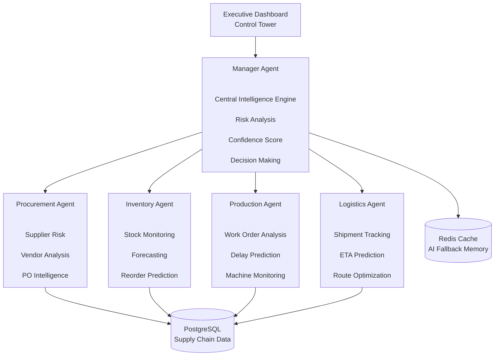
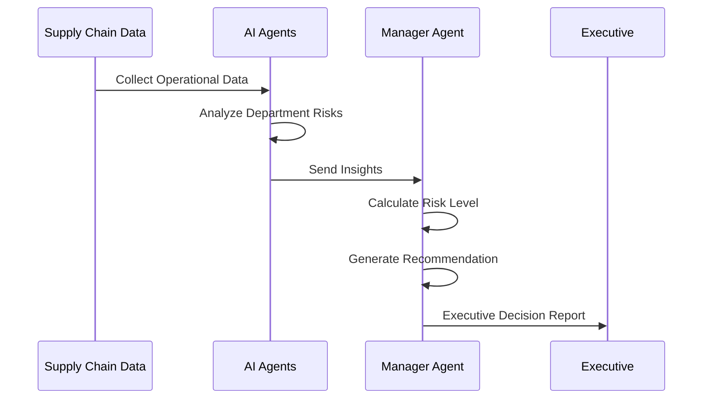
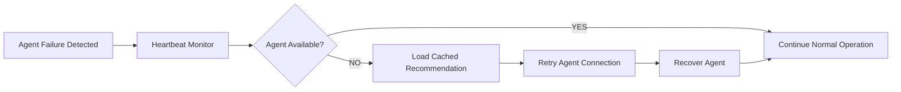
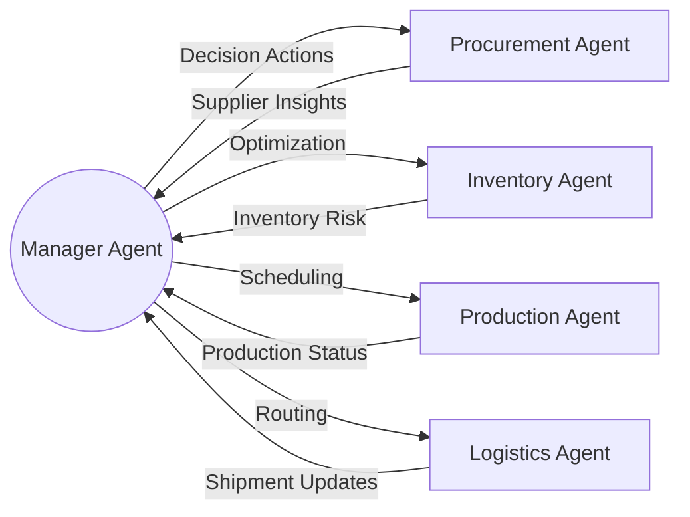

<div align="center">


# AI-Powered Fault-Tolerant Multi-Agent  
# Supply Chain Control Tower

### Intelligent Supply Chain Decision Platform

</div>


---

# System Architecture




---

# Multi-Agent Decision Flow





---

# Fault Tolerance Architecture





---

# AI Agent Communication





---

# Developer Mode Activated


<div align="center">


### When the AI Agent says:

> "I predicted the supply chain failure 3 days before it happened."


### Engineer:

> "Finally... no more emergency meetings."


</div>


---

# Real-Time Operations


<div align="center">


</div>


---

# Project Status


```text

Architecture          ████████████████████ 100%

Requirement Design    ████████████████████ 100%

Backend Development   ████████░░░░░░░░░░░  40%

AI Agents             ██████░░░░░░░░░░░░░  30%

Dashboard UI          ████░░░░░░░░░░░░░░░  20%

Deployment             ░░░░░░░░░░░░░░░░░░░  0%


```


---

<div align="center">


### Traditional Supply Chain:

"Where is my shipment?"


### AI Control Tower:

"Shipment delay predicted 72 hours earlier."


</div>
